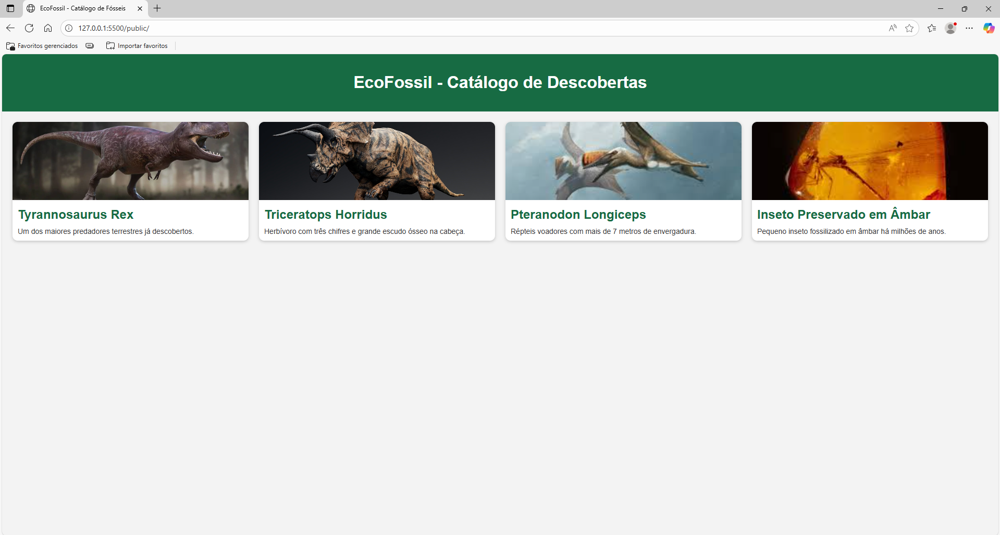
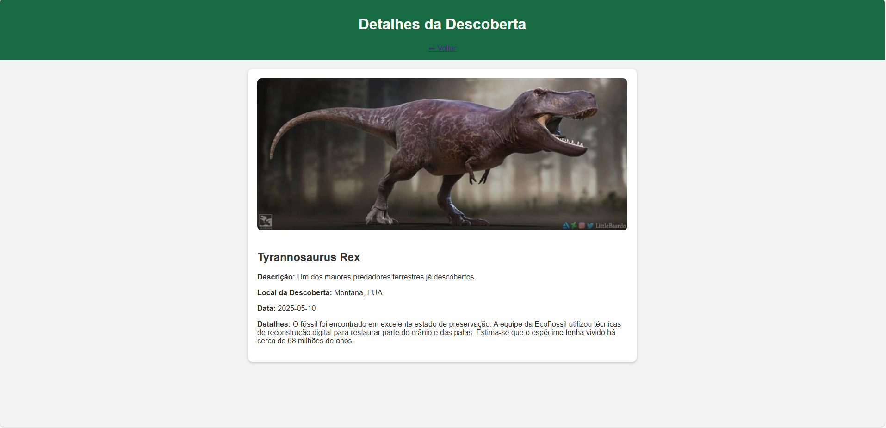

[](https://classroom.github.com/online_ide?assignment_repo_id=20906707&assignment_repo_type=AssignmentRepo)
# Trabalho Prático 05 - Semanas 7 e 8

**Páginas de detalhes dinâmicas**

Nessa etapa, vamos evoluir o trabalho anterior, acrescentando a página de detalhes, conforme o  projeto escolhido. Imagine que a página principal (home-page) mostre um visão dos vários itens que existem no seu site. Ao clicar em um item, você é direcionado pra a página de detalhes. A página de detalhe vai mostrar todas as informações sobre o item do seu projeto. seja esse item uma notícia, filme, receita, lugar turístico ou evento.

Leia o enunciado completo no Canvas. 

**IMPORTANTE:** Assim como informado anteriormente, capriche na etapa pois você vai precisar dessa parte para as próximas semanas. 

**IMPORTANTE:** Você deve trabalhar e alterar apenas arquivos dentro da pasta **`public`,** mantendo os arquivos **`index.html`**, **`styles.css`** e **`app.js`** com estes nomes, conforme enunciado. Deixe todos os demais arquivos e pastas desse repositório inalterados. **PRESTE MUITA ATENÇÃO NISSO.**

## Informações Gerais

- Nome: Kaua Henrique de Oliveira
- Matricula: 00903204
- Proposta de projeto escolhida: Temas e Conteúdos Associados
- Breve descrição sobre seu projeto: O site permite explorar e comparar diferentes animais pré-históricos, mostrando informações detalhadas sobre cada espécie, como tamanho, peso, período em que viveram e curiosidades. Ele funciona como um catálogo interativo, permitindo que os usuários visualizem comparações de tamanho entre os animais, aprendam sobre suas características e conheçam um pouco mais sobre a vida na era dos dinossauros. O foco é educativo e visual, tornando o aprendizado sobre pré-história mais dinâmico e intuitivo.

## Print da Home-Page



## Print da página de detalhes do item



## Cole aqui abaixo a estrutura JSON utilizada no app.js

```javascript
const dados = [
  {
    id: 1,
    nome: "Tyrannosaurus Rex",
    descricao: "Um dos maiores predadores terrestres já descobertos.",
    conteudo: "O fóssil foi encontrado em excelente estado de preservação. A equipe da EcoFossil utilizou técnicas de reconstrução digital para restaurar parte do crânio e das patas. Estima-se que o espécime tenha vivido há cerca de 68 milhões de anos.",
    local: "Montana, EUA",
    data: "2025-05-10",
    imagem: "img/trex.jpg"
  },
  {
    id: 2,
    nome: "Triceratops Horridus",
    descricao: "Herbívoro com três chifres e grande escudo ósseo na cabeça.",
    conteudo: "Encontrado em uma formação rochosa, este Triceratops contribuiu para entender como essa espécie se defendia dos grandes predadores. A equipe da EcoFossil reconstruiu digitalmente os chifres e parte do escudo.",
    local: "Dakota do Sul, EUA",
    data: "2025-03-02",
    imagem: "img/triceratops.jpg"
  },
  {
    id: 3,
    nome: "Pteranodon Longiceps",
    descricao: "Répteis voadores com mais de 7 metros de envergadura.",
    conteudo: "O exemplar recuperado pela EcoFossil estava incrivelmente preservado, revelando novos detalhes sobre a aerodinâmica dos pterossauros. As análises indicam adaptações únicas para o voo planado.",
    local: "Kansas, EUA",
    data: "2024-11-22",
    imagem: "img/pterosaur.jpg"
  },
  {
    id: 4,
    nome: "Inseto Preservado em Âmbar",
    descricao: "Pequeno inseto fossilizado em âmbar há milhões de anos.",
    conteudo: "O âmbar foi encontrado em um sítio de escavação na região amazônica. O DNA preservado permitirá estudos sobre a fauna do período Cretáceo. Essa descoberta reforça o compromisso da EcoFossil com a restauração da natureza original.",
    local: "Amazônia, Brasil",
    data: "2025-01-15",
    imagem: "img/amber.jpg"
  }
]

// --- Exibir cards na Home ---
const container = document.getElementById("catalogo")
if (container) {
  dados.forEach(item => {
    const card = document.createElement("div")
    card.classList.add("card")
    card.innerHTML = `
      
      <h2>${item.nome}</h2>
      <p>${item.descricao}</p>
    `
    card.addEventListener("click", () => {
      window.location.href = `detalhes.html?id=${item.id}`
    })
    container.appendChild(card)
  })
}

// --- Exibir detalhes ---
const detalhesContainer = document.getElementById("detalhes")
if (detalhesContainer) {
  const params = new URLSearchParams(window.location.search)
  const id = params.get("id")
  const item = dados.find(d => d.id == id)

  if (item) {
    detalhesContainer.innerHTML = `
      
      <h2>${item.nome}</h2>
      <p><strong>Descrição:</strong> ${item.descricao}</p>
      <p><strong>Local da Descoberta:</strong> ${item.local}</p>
      <p><strong>Data:</strong> ${item.data}</p>
      <p><strong>Detalhes:</strong> ${item.conteudo}</p>
    `
  } else {
    detalhesContainer.innerHTML = `<p>Item não encontrado!</p>`
  }
}
```